<div id="top"></div>

<!-- PROJECT LOGO -->
<br />
<div align="center">
  <a href="https://lab.skynetinc.tech/WorldDrknss">
    
  </a>

<h3 align="center">AlmaLinux</h3>

  <p align="center">
    Gettings started with AlmaLinux
    <br />
    <br />
    <a href="https://lab.skynetinc.tech/WorldDrknss/Guide-to-AlmaLinux/issues">Report Bug</a>
    ·
    <a href="https://lab.skynetinc.tech/WorldDrknss/Guide-to-AlmaLinux/issues">Request Feature</a>
  </p>
</div>

<!-- TABLE OF CONTENTS -->
<details>
  <summary>Table of Contents</summary>
  <ol>
    <li>
      <a href="#about-the-project">About The Project</a>
      <ul>
        <li><a href="#built-with">Built With</a></li>
      </ul>
    </li>
    <li>
      <a href="#getting-started">Getting Started</a>
      <ul>
        <li><a href="#prerequisites">Prerequisites</a></li>
      </ul>
    <li><a href="#installation">Installation</a></li>
    </li>
    <li>
      <a href="#hardening">Hardening</a>
      <ul>
        <li><a href="#ssh-creating">Creating Private/Public SSH Key</a></li>
        <li><a href="#ssh-adding">Adding SSH Public Key</a></li>
        <li><a href="#ssh-chmod">SSH Permissions</a></li>
        <li><a href="#ssh-chmod">Disabling password based SSH</a></li>
        <li><a href="#ssh-chmod">Allow user to SUDO without password</a></li>
        <li><a href="#fapolicyd">fapolicyd</a></li>
        <li><a href="#fapolicyd">wget issues</a></li>
      </ul>
    </li>
    <li><a href="#license">License</a></li>
    <li><a href="#contact">Contact</a></li>
    <li><a href="#acknowledgments">Acknowledgments</a></li>
  </ol>
</details>


<!-- ABOUT THE PROJECT -->
## About The Project

[![Product Name Screen Shot][product-screenshot]](https://almalinux.org)
AlmaLinux Desktop GUI

* Installation of AlmaLinux
* Utilizing DISA STIG Profiles
* Creating `ssh` keys
* Disabling password based `ssh` logins
* Allow user to `sudo` without password
* Working with `fapolicyd`
* Getting `wget` to work in FIPS Mode
* Optional Cloud Packages
  * Cloud-Init
  * Cloud-Utils-Growpart
  * GDisk

<p align="right">(<a href="#top">back to top</a>)</p>


### Built With

* [Almalinux](https://almalinux.org)

<p align="right">(<a href="#top">back to top</a>)</p>


<!-- GETTING STARTED -->
## Getting Started
### Prerequisites

1. Downloading AlmaLinux
    ```sh
    https://almalinux.org
    ```

2. Make bootable USB
  * **Linux:**

      Insert your target USB and locate it. There are different ways to do it but here are some of them:

      * `sudo fdisk -l` - this command shows you the connected block storage devices, including the USB devices.

      * `lsblk` - this command gives you all the available block storage devices, including the USB block storage devices.

      * `sudo blkid` - this command gives you the same information as lsblk, but you have to rub it as root.
        
        You need to look for /dev/sda or /dev/sdb or /dev/sdc, which is your target USB.

        After you found out the location of your target USB, navigate to the location of your source ISO. Run dd command to copy files from ISO to USB:
          
        ```sh
        sudo dd if=/AlmaLinux-9-latest-x86_64-dvd.iso of=/dev/sdc status=progress
        ```

        `dd` : Start the dd command to write DVD/CD iso image. `if=AlmaLinux-8-x86_64-Live-GNOME-Mini-beta-1.iso` : path to the input file. `of=/dev/sdc` : path to destination USB disk/stick. status=progress: display a progress bar while writing the image to the USB stick such as `/dev/sdb`. That’s all! You now have ready Live AlmaLinux on a USB stick.
    
  * **Windows:**
        
      For Windows OS there is a helpful free and open-source application - Rufus.

      Open the application, choose your target USB, ISO you need to burn, press start - and Live OS is ready to run.

  * **MacOS:**
      
      The cross-platform tool balenaEtcher is used to write images on macOS. It is simple too. Open banlenaEtcher, choose the image and the USB, press Flash.

      More details and information about AlmaLinux Live Media can be found on Live Media SIG.

## Installation
  1. When starting up AlmaLinux for the first time you will be granted with a welcome screen. Here select your language and keyboard type. Click **Continue**
  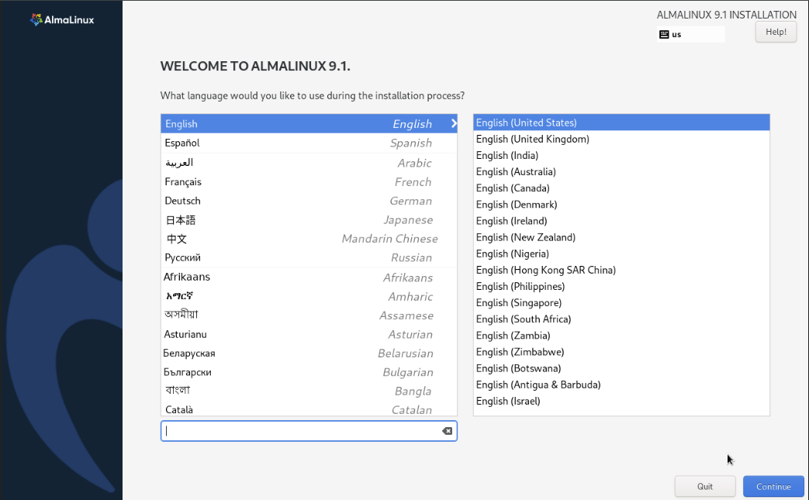
  2. Begin Installation:
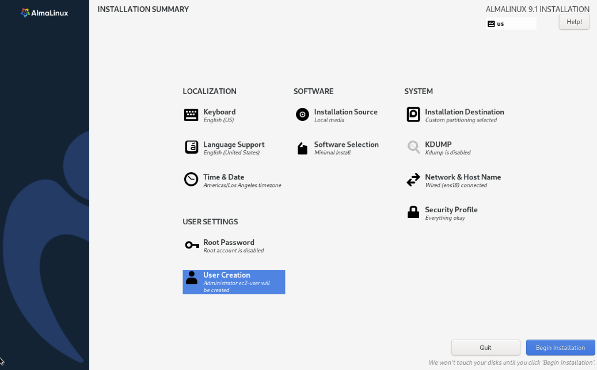
  3. Select User Creation: Create a user and assign that user a strong password. Make sure both `Make this user administrator` and `Require a password to use this account` are checked. Click **Done**
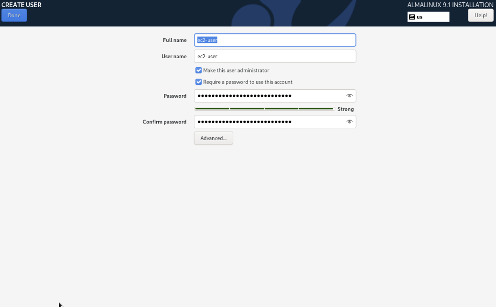
  4. Software Selection: For this instance we will select Minimal Install. Click **Done**

  5. Security Profile: We will highlight DISA STIG and click on `Select profile` It will issue some errors, you can disregard them as we will correct it in the next section. Click **Done**
  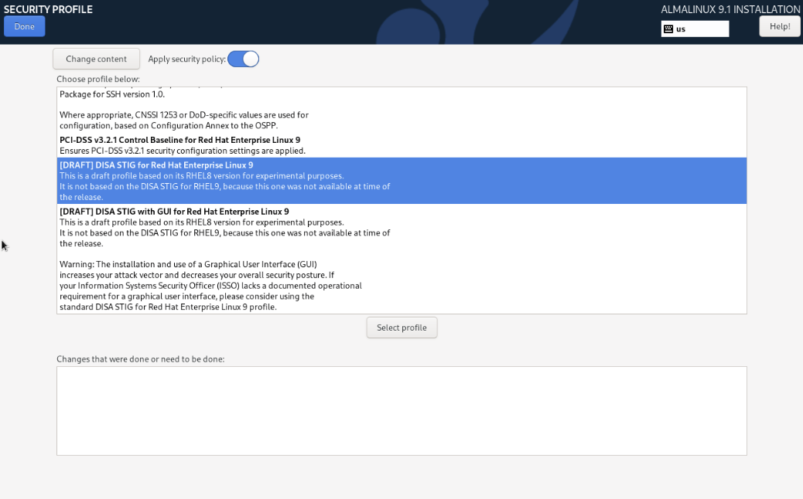
  6. Installation Destination: For `Storage Configuation` select `Custom`. Click **Done** This will bring you to the manual partitioning page.
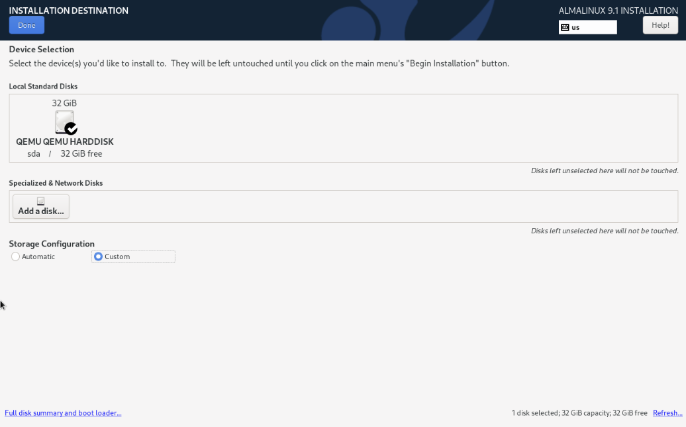
  7. Manual Partitioning: Add all the following `DATA` and `SYSTEM` mount points.
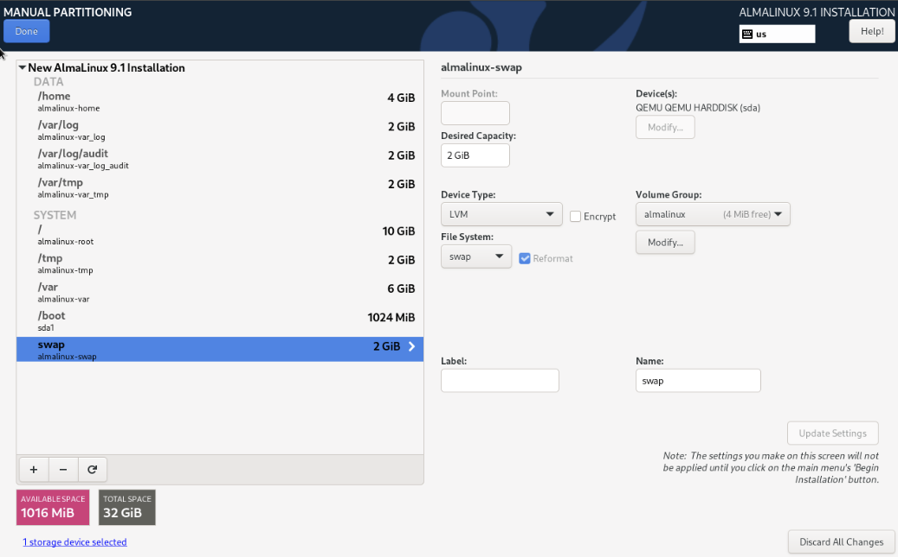
  8. Click on `Modify` under `Volume Group` and select "As large as possible" for `Size policy`. Click **Save** then click **Done**
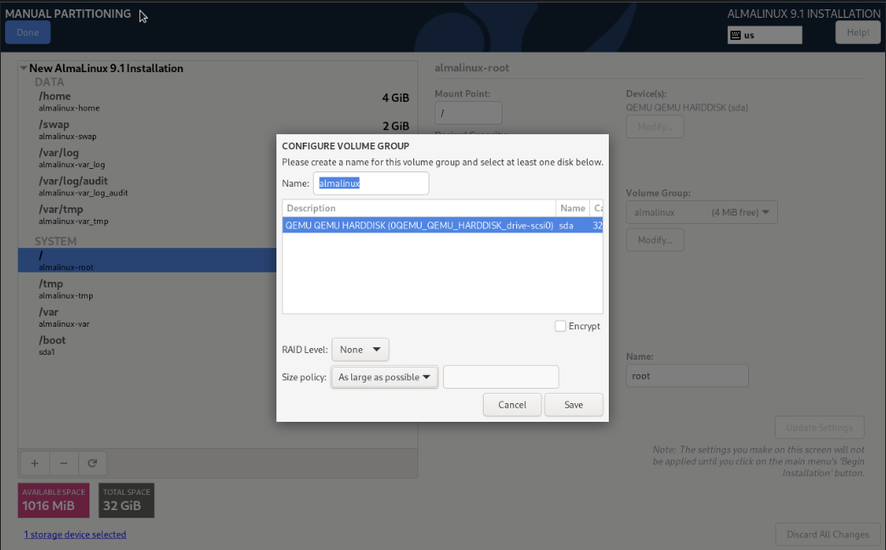
  9. Accept Partitioning Changes: Click on **Accept Changes**
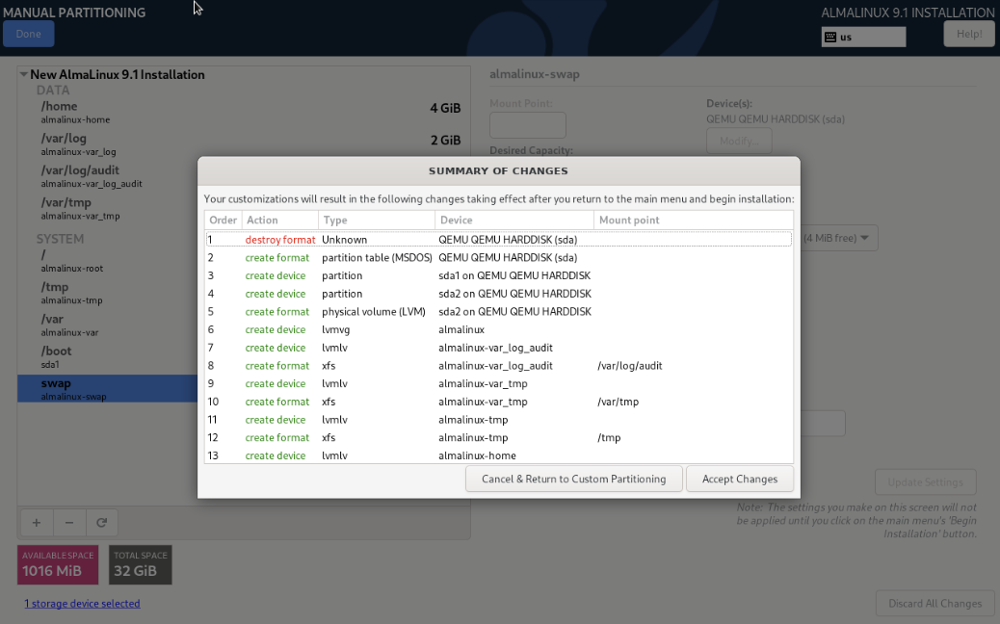
 10. Begin Installation: Click on **Begin Installation** to start installing AlmaLinux.


**Congratulations you have installed AlmaLinux**

<p align="right">(<a href="#top">back to top</a>)</p>

<!-- HARDENING -->
## Hardening

  ### Creating a SSH Key
  **Windows:**

  1. Open the Settings panel, then click Apps.
  2. Under the Apps and Features heading, click Optional Features.<br>
  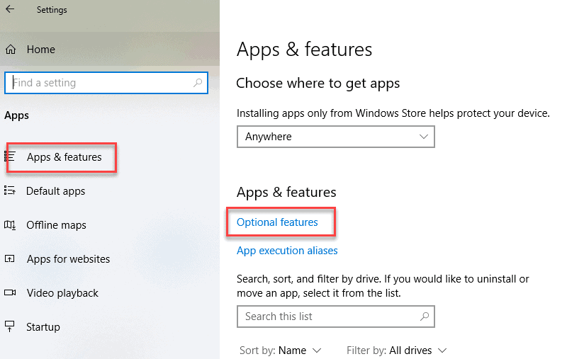

  3. Scroll down the list to see if OpenSSH Client is listed.<br>
  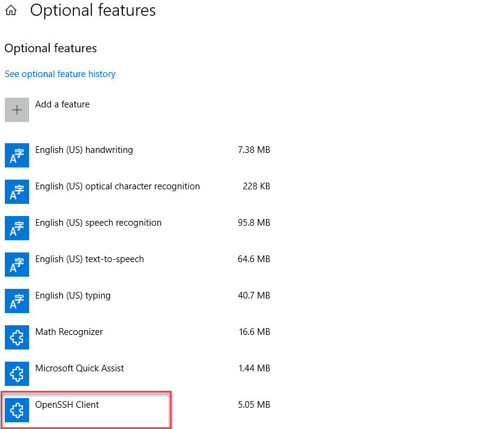
      * If it’s not, click the plus-sign next to Add a feature. <br>
      * Scroll through the list to find and select OpenSSH Client.<br>
      * Finally, click Install.

  4. Open Command Prompt.
      * Press the Windows key.
      * Type `cmd`.
      * Under *Best Match*, right-click Command Prompt.
      * Click `Run as administrator`
      
      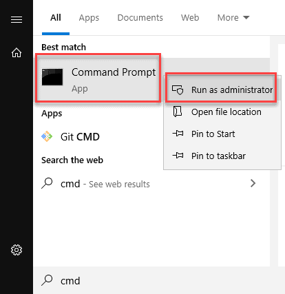

  5. If prompted, click **Yes** in the *Do you want to allow this app to make changes to your device?* pop-up.

  6. Use OpenSSH to Generate an SSH Key Pair
      * In the command prompt, type the following:
          ```sh
          ssh-keygen
          ```
          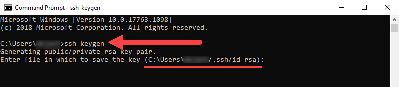
      * By default, the system will save the keys to C:\Users\your_username/.ssh/id_rsa. You can use the default name, or you can choose more descriptive names. This can help distinguish between keys, if you are using multiple key pairs. To stick to the default option, press Enter.
      * You’ll be asked to enter a passphrase. Hit Enter to skip this step.
      * The system will generate the key pair, and display the key fingerprint and a randomart image.
      * Open your file browser.
      * Navigate to C:\Users\your_username/.ssh.
      * You should see two files. The identification is saved in the id_rsa file and the public key is labeled id_rsa.pub. This is your SSH key pair.

  **Linux:**

  In your preferred terminal run the command `ssh-keygen`
  * By default, the system will save the keys to `~/.ssh`.
  * You should see two files. The identification is saved in the id_rsa file and the public key is labeled id_rsa.pub. This is your SSH key pair.

  **MacOS:**

  In Terminal run the command `ssh-keygen`
  * By default, the system will save the keys to `/Users/myname/.ssh`.
  * You should see two files. The identification is saved in the id_rsa file and the public key is labeled id_rsa.pub. This is your SSH key pair.

  ### SSH Permissions
  ```sh
  mkdir -p ~/.ssh
  touch ~/.ssh/authorized_keys
  chmod 700 ~/.ssh
  chmod 600 ~/.ssh/authorized_keys
  ```

  <p align="right">(<a href="#top">back to top</a>)</p>
  
  ### Adding SSH Public Key
  Replace $SSH with the content of the public key.
  ```sh
  echo "$SSH" >> ~/.ssh/authorized_keys
  ```
  <p align="right">(<a href="#top">back to top</a>)</p>
  
  ### Disabling password based SSH
  ```sh
  cd /etc/ssh
  sed -i 's/#PasswordAuthentication yes/PasswordAuthentication no/g' sshd_config
  systemctl restart sshd
  ```
<p align="right">(<a href="#top">back to top</a>)</p>

  ### Allow user to SUDO without password

  ```sh
  sudo su -
  visudo
  ```

  Press `Insert` on keyboard, substitute `$USER` with the user you created during installation.
  ```sh
  $USER  ALL=(ALL) NOPASSWD: ALL
  ```

  Press `esc` then type
  ```sh
  :wq
  ```

  This will save and close the terminal.
  
<p align="right">(<a href="#top">back to top</a>)</p>

  ### Working with fapolicyd
  fapolicyd starts in protection mode. We need to set fapolicyd to permissive mode to allow us to build the necessary rule sets for our individual systems.
  ```sh
  cd /etc/fapolicyd/
  sed -i 's/permissive = 0/permissive = 1/g' fapolicyd.conf
  systemctl restart fapolicyd
  ```
  See <a href="https://access.redhat.com/documentation/en-us/red_hat_enterprise_linux/8/html/security_hardening/assembly_blocking-and-allowing-applications-using-fapolicyd_security-hardening">RHEL: Blocking and Allowing applications with fapolicyd</a> for more information on building rules.

  <p align="right">(<a href="#top">back to top</a>)</p>

  ### Fixing wget
  As of current GnuTLS is not properly working with FIPS. To correct this we tell GnuTLS to disable health checks.

  ```sh
  export GNUTLS_SKIP_FIPS_INTEGRITY_CHECKS=1

  # Lets make is persistant
  cd /etc/profile.d/
  touch gnutls.sh
  echo "export GNUTLS_SKIP_FIPS_INTEGRITY_CHECKS=1" > gnutls.sh
  ```
  `wget` will now function as intended.

  <p align="right">(<a href="#top">back to top</a>)</p>

  <!-- CLOUD -->
  ## Optional Cloud Configurations:
  `cloud-init`: Cloud images are operating system templates and every instance starts out as an identical clone of every other instance. It is the user data that gives every cloud instance its personality and cloud-init is the tool that applies user data to your instances automatically.
  ```sh
  dnf install -y cloud-init
  ```

  `cloud-utils-growpart`: Provides the growpart script for growing a partition. It is primarily used in cloud images in conjunction with the dracut-modules-growroot package to grow the root partition on first boot.
  ```sh
  dnf install -y cloud-utils-growpart
  ```
  `gdisk`: GDISK command is used to partition the drives of your system. Works with cloud-init for partition resizing.
  ```sh
  dnf install -y gdisk
  ```

<!-- LICENSE -->
## License:

Distributed under the MIT License. See `LICENSE` for more information.

<p align="right">(<a href="#top">back to top</a>)</p>

<!-- CONTACT -->
## Contact:

Twitter - [@skynetinctech](https://twitter.com/skynetinctech)

Linkedin - [Charles Showalter](https://linkedin.com/in/charles-showalter)

Instagram - [@skynetinc.tech](https://twitter.com/skynetinc.tech)

Facebook - [@skynetinctech](https://facebook.com/skynetinctech)

Project Link: [https://lab.skynetinc.tech/WorldDrknss/Guide-to-AlmaLinux/](https://lab.skynetinc.tech/WorldDrknss/Guide-to-AlmaLinux/)

<p align="right">(<a href="#top">back to top</a>)</p>


<!-- MARKDOWN LINKS & IMAGES -->
<!-- https://www.markdownguide.org/basic-syntax/#reference-style-links -->
[twitter-shield]: https://img.shields.io/twitter/follow/skynetinctech?style=for-the-badge
[twitter-url]: https://twitter.com/skynetinctech
[linkedin-shield]: https://img.shields.io/badge/-LinkedIn-black.svg?style=for-the-badge&logo=linkedin&colorB=555
[linkedin-url]: https://linkedin.com/company/skynetinc
[product-screenshot]: Screenshot.png