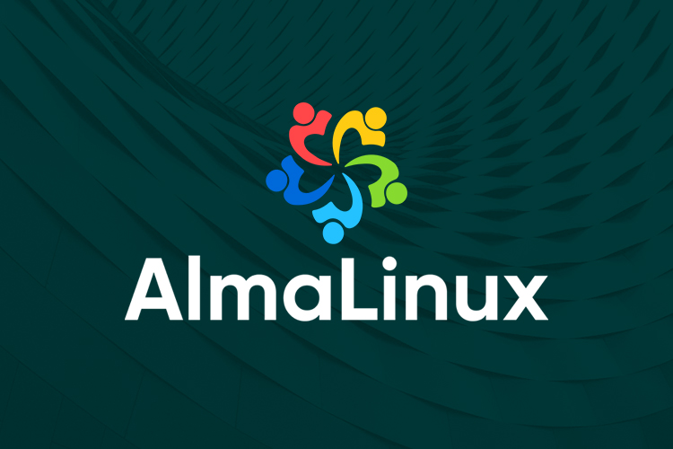

<div id="top"></div>

<!-- PROJECT LOGO -->
<br />
<div align="center">
  <a href="https://lab.skynetinc.tech/WorldDrknss">
    
  </a>

<h3 align="center">AlmaLinux</h3>

  <p align="center">
    Gettings started with AlmaLinux
    <br />
    <br />
    <a href="https://lab.skynetinc.tech/WorldDrknss/Guide-to-AlmaLinux/issues">Report Bug</a>
    ·
    <a href="https://lab.skynetinc.tech/WorldDrknss/Guide-to-AlmaLinux/issues">Request Feature</a>
  </p>
</div>

<!-- TABLE OF CONTENTS -->
<details>
  <summary>Table of Contents</summary>
  <ol>
    <li>
      <a href="#about-the-project">About The Project</a>
      <ul>
        <li><a href="#built-with">Built With</a></li>
      </ul>
    </li>
    <li>
      <a href="#getting-started">Getting Started</a>
      <ul>
        <li><a href="#prerequisites">Prerequisites</a></li>
        <li><a href="#installation">Installation</a></li>
      </ul>
    </li>
    <li>
      <a href="#hardening">Hardening</a>
      <ul>
        <li><a href="#ssh-creating">Creating Private/Public SSH Key</a></li>
        <li><a href="#ssh-adding">Adding SSH Public Key</a></li>
        <li><a href="#ssh-chmod">SSH Permissions</a></li>
        <li><a href="#ssh-chmod">Disabling password based SSH</a></li>
        <li><a href="#ssh-chmod">Allow user to SUDO without password</a></li>
        <li><a href="#fapolicyd">fapolicyd</a></li>
        <li><a href="#fapolicyd">wget issues</a></li>
      </ul>
    </li>
    <li><a href="#license">License</a></li>
    <li><a href="#contact">Contact</a></li>
    <li><a href="#acknowledgments">Acknowledgments</a></li>
  </ol>
</details>


<!-- ABOUT THE PROJECT -->
## About The Project

[![Product Name Screen Shot][product-screenshot]](https://almalinux.org)
Proof of concept e-commerce store using Angular, .Net Core and Stripe for payment processing

* Installation of AlmaLinux
* Utilizing DISA STIG Profiles
* Creating `ssh` keys
* Disabling password based `ssh` logins
* Allow user to `sudo` without password
* Working with `fapolicyd`
* Getting `wget` to work in FIPS Mode
* Optional Cloud Packages
  * Cloud-Init
  * Cloud-Utils-Growpart
  * GDisk

<p align="right">(<a href="#top">back to top</a>)</p>


### Built With

* [Almalinux](https://almalinux.org)

<p align="right">(<a href="#top">back to top</a>)</p>


<!-- GETTING STARTED -->
## Getting Started

To get a local copy up and running follow these simple example steps.

### Prerequisites

This is an example of how to list things you need to use the software and how to install them.

Downloading AlmaLinux
  ```sh
  https://almalinux.org
  ```

Make bootable USB
1. **Linux:**

    Insert your target USB and locate it. There are different ways to do it but here are some of them:

    * `sudo fdisk -l` - this command shows you the connected block storage devices, including the USB devices.

    * `lsblk` - this command gives you all the available block storage devices, including the USB block storage devices.

    * `sudo blkid` - this command gives you the same information as lsblk, but you have to rub it as root.
      
      You need to look for /dev/sda or /dev/sdb or /dev/sdc, which is your target USB.

      After you found out the location of your target USB, navigate to the location of your source ISO. Run dd command to copy files from ISO to USB:
        
      ```sh
      sudo dd if=/AlmaLinux-9-latest-x86_64-dvd.iso of=/dev/sdc status=progress
      ```

      `dd` : Start the dd command to write DVD/CD iso image. `if=AlmaLinux-8-x86_64-Live-GNOME-Mini-beta-1.iso` : path to the input file. `of=/dev/sdc` : path to destination USB disk/stick. status=progress: display a progress bar while writing the image to the USB stick such as `/dev/sdb`. That’s all! You now have ready Live AlmaLinux on a USB stick.
  
2. **Windows**:
      
      For Windows OS there is a helpful free and open-source application - Rufus.

      Open the application, choose your target USB, ISO you need to burn, press start - and Live OS is ready to run.

3. **MacOS:**
    
    The cross-platform tool balenaEtcher is used to write images on macOS. It is simple too. Open banlenaEtcher, choose the image and the USB, press Flash.

    More details and information about AlmaLinux Live Media can be found on Live Media SIG.

### Installation
Coming Soons

<p align="right">(<a href="#top">back to top</a>)</p>

<!-- HARDENING -->
## Hardening

## Creating Private/Public SSH Key
**Windows:**

**Linux:**

**MacOS:**

### Adding SSH Public Key
Replace $SSH with the content of the public key.
```sh
echo "$SSH" >> ~/.ssh/authorized_keys
```
### SSH Permissions
```sh
mkdir -p ~/.ssh
touch ~/.ssh/authorized_keys
chmod 700 ~/.ssh
chmod 600 ~/.ssh/authorized_keys
```
### Disabling password based SSH
```sh
cd /etc/ssh
sed -i 's/#PasswordAuthentication yes/PasswordAuthentication no/g' sshd_config
systemctl restart sshd
```
### Allow user to SUDO without password

```sh
sudo su -
visudo
```
Press `Insert` on keyboard, substitute `$USER` with the user you created during installation.
```sh
$USER  ALL=(ALL) NOPASSWD: ALL
```
### Working with fapolicyd
fapolicyd starts in protection mode. We need to set fapolicyd to permissive mode to allow us to build the necessary rule sets for our individual systems.
```sh
cd /etc/fapolicyd/
sed -i 's/permissive = 0/permissive = 1/g' fapolicyd.conf
systemctl restart fapolicyd
```
See <a href="https://access.redhat.com/documentation/en-us/red_hat_enterprise_linux/8/html/security_hardening/assembly_blocking-and-allowing-applications-using-fapolicyd_security-hardening">RHEL: Blocking and Allowing applications with fapolicyd</a> for more information on building rules.

### Fixing wget
As of current GnuTLS is not properly working with FIPS. To correct this we tell GnuTLS to disable health checks.

```sh
cd /etc/profile.d/
touch gnutls.sh
echo "export GNUTLS_SKIP_FIPS_INTEGRITY_CHECKS=1" > gnutls.sh
```
`wget` will now function as intended.
<p align="right">(<a href="#top">back to top</a>)</p>

<!-- LICENSE -->
## License

Distributed under the MIT License. See `LICENSE` for more information.

<p align="right">(<a href="#top">back to top</a>)</p>

<!-- CONTACT -->
## Contact

Twitter - [@skynetinctech](https://twitter.com/skynetinctech)

Linkedin - [Charles Showalter](https://linkedin.com/in/charles-showalter)

Instagram - [@skynetinc.tech](https://twitter.com/skynetinc.tech)

Facebook - [@skynetinctech](https://facebook.com/skynetinctech)

Project Link: [https://lab.skynetinc.tech/WorldDrknss/Guide-to-AlmaLinux/](https://lab.skynetinc.tech/WorldDrknss/Guide-to-AlmaLinux/)

<p align="right">(<a href="#top">back to top</a>)</p>


<!-- MARKDOWN LINKS & IMAGES -->
<!-- https://www.markdownguide.org/basic-syntax/#reference-style-links -->
[twitter-shield]: https://img.shields.io/twitter/follow/skynetinctech?style=for-the-badge
[twitter-url]: https://twitter.com/skynetinctech
[linkedin-shield]: https://img.shields.io/badge/-LinkedIn-black.svg?style=for-the-badge&logo=linkedin&colorB=555
[linkedin-url]: https://linkedin.com/company/skynetinc
[product-screenshot]: Screenshot.png